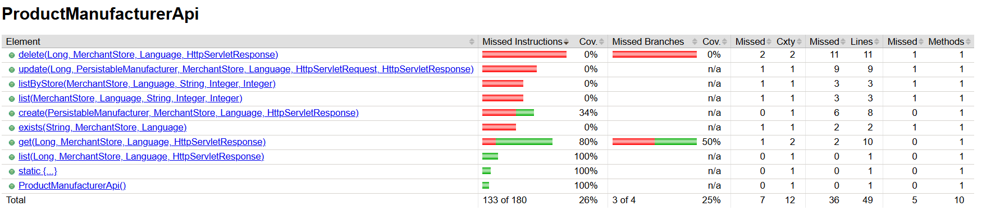

# Shopizer


Shopizer is enterprise open source e-commerce software for retailers who want flexibility, speed and control of their commerce platform. Shopizer is a software solution that gives organizations the ultimate flexibility to take an experience-first approach to commerce, with simple powerful APIs and built in stores models.

**Key technical benefits**

Built with Spring framework
Vulnerability checks
Open source and open standards
Cloud Ready: Deploy Shopizer in the public
or private cloud on Amazon Webservices (AWS), Microsoft
Azure or Google Cloud Platform (GCP)
Run on premise servers
Run from Docker containers
Run from any Java servlet containers such as Tomcat
Shopizer is a an application composed of a set of services written in Java that serves functionality needed to build entreprise e-commerce systems.

The software can be used out of the box as a complete ready to use web application including a few web stores templates you can choose from. Shopizer can also be used as a restful backend application for serving a whole set of commerce REST apis on which you can build your own tailored e-commerce front store.

Shopizer e-commerce system provides the following functionality:

Catalog and products management
Shopping cart
Content management
Marketing components
Smart pricing
Ordering
Payment
Shipping

Java open source e-commerce software

Headless commerce and Rest api for ecommerce

- Catalog
- Shopping cart
- Checkout
- Merchant
- Order
- Customer
- User

Shopizer Headless commerce consists of the following components:

- Spring boot Java / Spring boot backend
- Angular administration web application
- React JS front end application


Demo:
-------------------

1.  Run from Docker images:

From the command line:

```
docker run -p 8080:8080 shopizerecomm/shopizer:latest
```

API documentation:
-------------------

https://app.swaggerhub.com/apis-docs/shopizer/shopizer-rest-api/3.0.1#/

To test out:

Credentials: 
Username: admin@shopizer.com
Password: password

To Test the Web Application: 

Disclaimer: This project is extensive and requires nearly an hour to complete the entire process. Due to the significant time consumption with Docker integration, I opted for the following approach using automation scripts for better efficiency.

Assuming you have Java, Maven, and Docker Installed

1. Clone the repository

```
git clone https://github.com/HasiniChenchala2/shopizer
```

2. Run the automation script

```
pip install grammarinator
```
The grammar file contains grammar for 15 APIs

CATALOG:

| Routes           | Method  | Endpoint                                           
|------------------|---------|-----------------------------------------
| /catalog         | GET     | /{id}                                               
| /catalog         | POST    |                                              
| /catalog         | PUT     | /{id}                               
| /catalog         | DELETE  | /{id}    

MANUFACTURER:

| Routes              | Method  | Endpoint                                           
|---------------------|---------|-----------------------------------------
| /manufacturers      | GET     | /{id}                                                                                        
| /manufacturers      | PUT     | /{id}                               

CART:

| Routes              | Method  | Endpoint                                           
|---------------------|---------|-----------------------------------------
| /cart               | POST    |                                                                                         
| /cart               | DELETE  | /{code}/product/{id}

CATEGORY:

| Routes           | Method  | Endpoint                                           
|------------------|---------|-----------------------------------------
| /category        | GET     | /product/{id}                                               
| /category        | GET     | ?count={count}&page={pagecount}                                                                   
| /category        | DELETE  | /{id}

CUSTOMER:

| Routes           | Method  | Endpoint                                           
|------------------|---------|-----------------------------------------
| /customers       | GET     | /{id}/reviews                                               
| /customer        | POST    | /login                                                                   
| /customer        | DELETE  | /{id}

For windows:

```
automation_script.bat
```

For Linux/MacOS:

```
chmod +x automation_script.sh
./automation_script.sh
```

By now, the grammarinator processes and generates the Lexer file and also generates the grammar inputs for 5 APIs using the lexer file.

| Routes           | Method  | Endpoint                                           
|------------------|---------|-----------------------------------------
| /catalog         | GET     | /{id}                                               
| /catalog         | POST    |                                              
| /catalog         | PUT     | /{id}                               
| /catalog         | DELETE  | /{id} 
| /manufacturers   | GET     | /{id} 

The grammar input files generated by grammarinator can be seen in the path: \sm-shop\src\test\resources
The files generated are : getCatalog.json, deleteCatalog.json, patchCatalog.json, postCatalog.json, getManufacturer.json
These files contains grammar inputs generated by grammarinator specific to APIs


To build the application:
-------------------

From the command line:

```
mvn clean install
```
Change cwd to sm-shop
```
cd sm-shop
```
To get coverage report before grammarinator generated grammar inputs
```
mvn clean test jacoco:report -P exclude-grammarTest && xcopy "target\site\jacoco" ".\old_report\" /E
```
You can see the report in **sm-shop/old-report**

To view the report in browser open **sm-shop/old-report/index.html** from File Explorer

To get coverage report after grammarinator generated grammar inputs
```
mvn clean test jacoco:report && xcopy "target\site\jacoco" ".\new_report\" /E
```
You can see the report in **sm-shop/new-report**

To view the report in browser open **sm-shop/new-report/index.html** from File Explorer

To compare both the reports for the APIs used.

Navigate to **/sm-shop/old_report/com.salesmanager.shop.store.api.v1.catalog/index.html** in old report and **/sm-shop/new_report/com.salesmanager.shop.store.api.v1.catalog/index.html** in new report.

Check the coverage for following catalog APIs:
1. createCatalog(PersistableCatalog, MerchantStore, Language)
2. getCatalog(Long, MerchantStore, Language)
3. deleteCatalog(Long, MerchantStore, Language)
4. updateCatalog(Long, PersistableCatalog, MerchantStore, Language)

**Old Report Coverage-Catalog:**


**New Report Coverage-Catalog:**


Navigate to **/sm-shop/old_report/com.salesmanager.shop.store.api.v1.product/index.html** in old report and **/sm-shop/new_report/com.salesmanager.shop.store.api.v1.product/index.html** in new report.

5. get(Long, MerchantStore, Language, HttpServletResponse)

**Old Report Coverage-Manufacturer:**


**New Report Coverage-Manufacturer:**



### Documentation:
-------------------

Documentation available <https://shopizer-ecommerce.github.io/documentation/>

Api documentation <https://app.swaggerhub.com/apis-docs/shopizer/shopizer-rest-api/3.0.1#/>

ChatOps <https://shopizer.slack.com>  - Join our Slack channel <https://communityinviter.com/apps/shopizer/shopizer>

More information is available on shopizer web site here <http://www.shopizer.com>